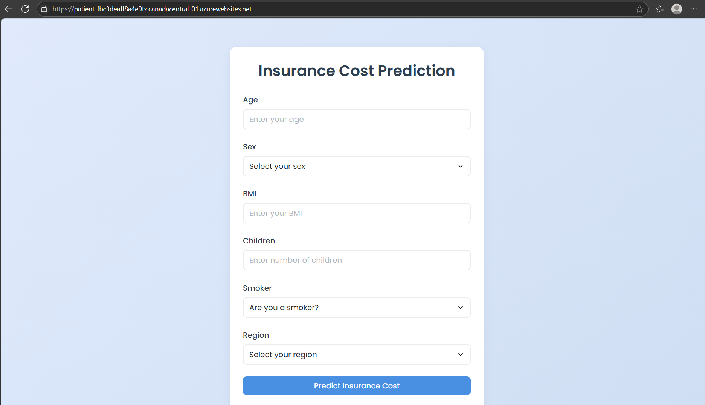

# Predicting Patient Charges

[](https://join.slack.com/t/ngc-goz8665/shared_invite/zt-r01kumfq-dQUT3c95BxEP_fnk4yJFfQ)


This project implements a web application to predict medical insurance costs using demographic and health data, leveraging PyCaret and Flask. It includes model training, a web API, and deployment via Docker and Azure.

---

## Project Structure 2025

```
.
├── app/
│   ├── app.py           # Flask backend
│   └── templates/
│       └── home.html    # HTML frontend
├── data/                # Dataset
│   └── insurance.csv
├── models/              # Trained models
│   └── insurance_model.pkl
├── train_model.py       # Training script
├── download_dataset.py  # Script to download the dataset
├── requirements.txt     # Dependencies
├── Dockerfile           # Docker image
└── README.md            # This file
```

---

## 0. Setting up the Virtual Environment

1. Create a new virtual environment:
   ```bash
   # On Windows
   python -m venv venv

   # On macOS/Linux
   python3 -m venv venv
   ```

2. Activate the virtual environment:
   ```bash
   # On Windows
   .\venv\Scripts\activate

   # On macOS/Linux
   source venv/bin/activate
   ```

3. Verify the virtual environment is active (you should see `(venv)` at the beginning of your command prompt)

4. Deactivate the virtual environment when you're done:
   ```bash
   deactivate
   ```

---

## 1. Model Training

1. Install dependencies:
   ```bash
   pip install -r requirements.txt
   ```
2. Download the dataset:
   ```bash
   python download_dataset.py
   ```
3. Train and save the model:
   ```bash
   python train_model.py
   ```

---

## 2. Running the Web Application Locally

1. From the project root, run:
   ```bash
   python app/app.py
   ```
2. Open your browser at [http://localhost:5000](http://localhost:5000)

---

## 3. Dockerization and Azure Deployment

### A. Log in to Azure Container Registry (ACR)

```bash
docker login patient.azurecr.io
```

### B. Build the Docker image and tag for ACR

```bash
docker build -t patient.azurecr.io/pycaret-insurance:latest .
```

### C. Push the image to ACR

```bash
docker push patient.azurecr.io/pycaret-insurance:latest
```

### D. Configure and Deploy on Azure Web App

1. Go to the Azure portal and create a Web App for containers.
2. In the Web App configuration, select your ACR and the image `pycaret-insurance:latest`.
3. Save and restart the Web App.
4. Access the public URL provided by Azure (e.g., `https://<your-app>.azurewebsites.net`).

---

## 4. Notes for Azure Deployment
- The `app.py` file should contain:
  ```python
  import os
  if __name__ == '__main__':
      port = int(os.environ.get("PORT", 5000))
      app.run(host='0.0.0.0', port=port)
  ```
- If you see 504 errors or the app does not respond, check the logs in the Azure Portal (Deployment Center > Logs).
- Ensure the image tag is `latest` and there are no typos.

---

## 5. Credits
Developed by Esteban Ordoñez for the MLOps and Cloud Model Deployment course.

---

## 6. Usage Examples

### A. Using the Web Form

1. Open the application in your browser (locally or on Azure).
2. Enter the following sample data:
   - Age: 35
   - Sex: male
   - BMI: 28.5
   - Children: 2
   - Smoker: no
   - Region: northwest
3. Click "Predict Insurance Cost" to see the expected cost prediction.

### B. Using the REST API (endpoint `/predict_api`)

You can make a POST request with JSON using `curl` or Postman:

```bash
curl -X POST \
  https://<your-app>.azurewebsites.net/predict_api \
  -H 'Content-Type: application/json' \
  -d '{
    "age": 35,
    "sex": "male",
    "bmi": 28.5,
    "children": 2,
    "smoker": "no",
    "region": "northwest"
  }'
```

The response will be the predicted insurance cost value.

---

## 7. Sources and References
- [Tutorial Machine Learning Pipelines & MLOps Deployment - DataCamp](https://www.datacamp.com/tutorial/tutorial-machine-learning-pipelines-mlops-deployment)
- [Publishing Docker images to Azure Container Registry with GitHub Actions - DEV.to](https://dev.to/reniciuspagotto/publishing-docker-image-in-azure-container-registry-with-github-actions-4i7)

> **Live Demo:** [https://patient-fbc3deaff8a4e9fx.canadacentral-01.azurewebsites.net/predict](https://patient-fbc3deaff8a4e9fx.canadacentral-01.azurewebsites.net/predict)

---

## Visualización de la aplicación desplegada



> **Nota:** El enlace de la demo estará disponible solo hasta el 06 de julio de 2025, ya que este proyecto utiliza el free trial de Azure.